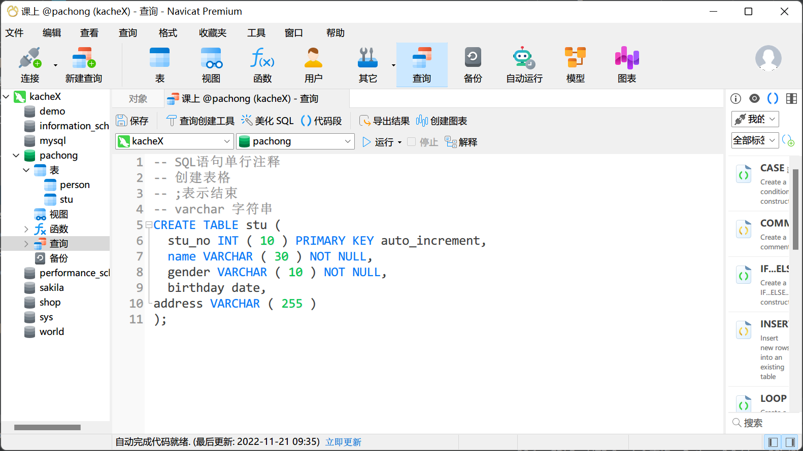
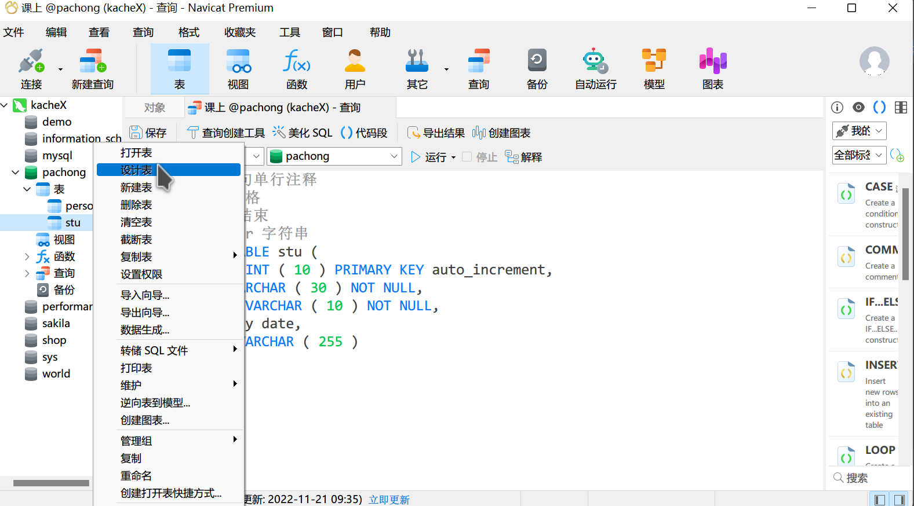

## 表的操作

### 创建表

创建表有两种方案：

1. 用SQL语句创建表格

```mysql
create table student(
    sno int(10) primary key auto_increment,
    sname varchar(50) not null,
    sbirthday date not null,
    saddress varchar(255),
    sphone varchar(12),
    class_name varchar(50)
);
```

- 数据类型：
  <br>int 整数
  <br>double 小数
  <br>varchar 字符串
  <br>date 时间（年月日）
  <br>datetime 时间（年月日时分秒）
  <br>text 大文本
  <br>
- 约束条件
  <br>primary key 主键，全表唯一值。就像学号、身份证号，能够唯一的确定一条数据
  <br>auto_increment 主键自增
  <br>not null 不可以为空
  <br>null 可以为空
  <br>default 设置默认值

2. 用Navicat图形化工具来创建



### 修改表

1. SQL方式（了解）

   ```mysql
   -- 添加一列
   ALTER TABLE table_name
   ADD COLUMN column_name datatype;
   -- 删除一列
   ALTER TABLE table_name
   DROP COLUMN column_name;
   -- 修改一列的数据类型
   ALTER TABLE table_name
   MODIFY COLUMN column_name datatype;
   -- 表格重命名
   ALTER TABLE table_name RENAME TO new_name;
   ```
2. navicat方式

   

## 数据的操作-增删改查-数据（重点）

### 增加数据

```mysql
INSERT INTO table_name(col1, col2, col3...) values (val1, val2, val3);
```

```mysql
-- 添加学生信息
INSERT INTO STUDENT(sname, sbirthday, saddress, sage, class_name) values ('周杰伦', '2020-01-02', 18, '二班');
```

### 查询数据

#### 基础查询

```mysql
SELECT *|col1, col2, col3
FROM table_name
where_clause;
```

```mysql
-- 全表查询
SELECT * FROM STUDENT;

-- 查询学生姓名,年龄
SELECT sname, sage FROM STUDENT;

-- 查询学号是1的学生信息
select * from student where sno = 1;

-- 查询年龄大于20的学生信息
select * from student where sage > 20;

-- 查询学生年龄大于20 小于40的信息(包含)
select * from student where sage >= 20 and sage <= 40;
select * from student where sage between 20 and 40;

-- 查询姓张的学生信息
--     _ 1位字符串
--     %多位字符串
select * from student where sname like '张%';
```

#### 分组查询和聚合函数

```mysql
select * from table_name group by col_name;
```

注意,上方的sql是无法使用的, sql要求分组后, 到底要做什么必须明确指出, 否则会报错

分组后计算每个班级的平均年龄, 平均数如何计算,需要用到聚合函数. sql中提供了5种聚合函数:

`avg() max() min() sum() count()`

```mysql
-- 查询每一个班级的平均年龄
select avg(sage), class_name from STUDENT group by class_name;

-- 查询每个班级最小的年龄
select min(sage), class_name from STUDENT group by class_name;

-- 查询每个班级的最大年龄
select max(sage), class_name from STUDENT group by class_name;

-- 查询每个班级的学生数量
select count(*), class_name from STUDENT group by class_name;

-- 查询每个班级的年龄和
select sum(sage), class_name from STUDENT group by class_name;
```

注意不要把没有放在group by后面的内容直接放在select中

#### having语句

如果我们需要对聚合函数计算的结果进一步的筛选, 可以用having语句

```mysql
-- 查询平均年龄在15岁以上的班级信息
select avg(sage), class_name from student group by class_name having avg(sage) > 15;
```

having和where的区别:

1. where, 在原始数据上进行的数据筛选.
2. having, 在聚合函数计算后的结果进行筛选.

#### 排序

sql中使用order by语句对查询结果进行排序

```mysql
-- 按照年龄从小到大查询学生信息
select * from student order by sage asc;

-- 按照年龄从大到小查询学生信息
select * from student order by sage desc;
```

## Python连接MySQL

python连接mysql可以用pymysql模块

```python
pip install pymysql
```

pymysql基本使用:

```python

import pymysql

# 连接数据库
conn = pymysql.connect(
    host='localhost',
    port=3306,
    user='root',
    password='123456',
    database='spider_back'
)
# 创建游标
cursor = conn.cursor()
# 接下来就可以用游标去执行各种操作了

cursor.close()  # 断开cursor
conn.close()  # 断开连接
```

### pymysql执行增删改操作

#### 添加数据

```python
try:
    cursor = conn.cursor()
    sql = "insert into stu(sname, address, gender) values ('李嘉诚', '八宝山', '男')"
    result = cursor.execute(sql)
    print(result)  # result是该sql会影响多少条数据
    conn.commit()  # 提交
except:
    conn.rollback()  # 回滚

cursor.close()  # 断开cursor
conn.close()  # 断开连接
```

#### 修改数据

```python
try:
    cursor = conn.cursor()
    result = cursor.execute("update stu set gender = '男' where sid = 12")
    print(result)  # result是该sql会影响多少条数据
    conn.commit()  # 提交
except:
    conn.rollback()  # 回滚

cursor.close()  # 断开cursor
conn.close()  # 断开连接
```

#### 删除数据

```python
try:
    cursor = conn.cursor()
    result = cursor.execute("delete from stu where sid = 12")
    print(result)  # result是该sql会影响多少条数据
    conn.commit()  # 提交
except:
    conn.rollback()  # 回滚

cursor.close()  # 断开cursor
conn.close()  # 断开连接
  
```

### 查询操作

```python
# 查询
from pymysql.cursors import DictCursor
# cursor = conn.cursor(DictCursor)  # 使用字典游标, 查询出的结果自动保存在字典中
cursor = conn.cursor()  # 默认游标, 查询出的结果自动保存在元组中

sql = "select * from stu"
ret_num = cursor.execute(sql)
# result = cursor.fetchall()  # 获取全部结果
# result = cursor.feetchmany(5)  # 获取部分结果
result = cursor.fetchone()  # 获取单个结果
print(result)
result = cursor.fetchone()  # 获取单个结果,可以连续获取

cursor.close()  # 断开cursor
conn.close()  # 断开连接 
```

注意, 一个游标如果被拿空了, 则不能再次获取内容


附:MYSQL远程连接时, 必须对数据库做一个简短的配置

1. 打开mysql命令行
2. 输入以下内容

   ```mysql
   GRANT ALL PRIVILEGES ON *.* TO '用户名'@'%' IDENTIFIED BY '密码' WITH GRANT OPTION;
   FLUSH PRIVILEGES;
   ```
