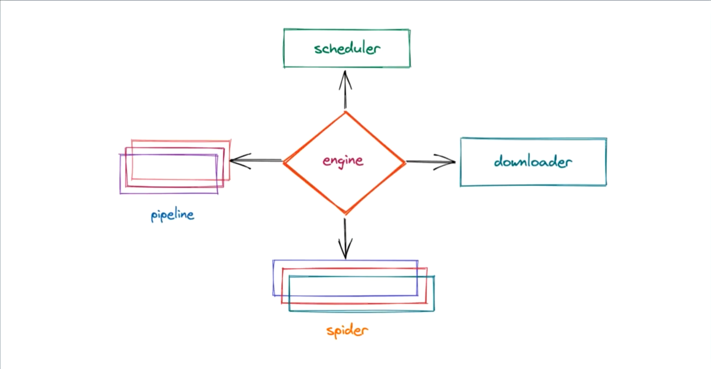

# Scrapy 基本介绍与使用

## 一、爬虫工程化

- 爬虫工程化：
  - 对爬虫的功能进行模块化的开发。并达到可以批量生产的效果

## 二、scrapy简介

- 特点：速度快，简单，可扩展性强
- scrapy的官方文档：https://docs.scrapy.org/en/latest/

## 三、scrapy工作流程

- scrapy的工作流程：

  
- 整个工作流程：

  1. 爬虫中起始的url构造成request对象，并传递给调度器
  2. `引擎`从`调度器`中获取到request对象，然后交给`下载器`
  3. 由`下载器`来获取到页面源代码，并封装成response对象，并回馈给`引擎`
  4. `引擎`将获取到的response对象传递给`spider`，由`spider`对数据进行解析，并回馈给`引擎`
  5. `引擎`将数据传递给pipline进行数据持久化保存或进一步的数据处理
  6. 在此期间如果spider中提取到的并不是数据，而是子页面url，可以进一步提交给调度器，进而重复`步骤2`的过程
- 上述过程中一直在重复着几个东西

  1. 引擎
     scrapy的核心，所有模块的衔接，数据流程梳理
  2. 调度器
     本质上这东西可以看成是一个集合和队列，里面存放着一堆我们即将要发送的请求，可以看成是一个url的容器，它决定了下一步要去爬取哪一个url，通常我们在这里可以对url进行去重操作
  3. 下载器

     它的本质就是用来发动请求的一个模块，小白们完全可以把它理解成是一个requests.get()的功能，只不过返回的是一个response对象
  4. 爬虫

     这是我们要写的第一个部分的内容，负责解析下载器返回的response对象，从中提取到我们需要的数据
  5. 管道

     这是我们要写的第二个部分的内容，主要负责数据的存储和各种持久化操作

## 四、scrapy安装

👀️ 注意：由于scrapy的升级，导致scrapy-redis无法正常使用，所以这里选择2.5.1这个版本作为学习，后期可以根据scrapy-redis的升级而跟着升级scrapy

```
pip install scrapy==2.5.1
```

## Scrapy实例

用scrapy完成一个超级简单的爬虫，目标：深入理解Scrapy工作的流程，以及各个模块之间是如何搭配的

1. 创建项目
   `scrapy startproject 项目名称`
   示例：
   `scrapy startproject mySpider_2`
   创建好项目后，我们可以在pycharm里观察到scrapy帮我们创建一个文件夹，里面的目录结构如下：
   ```python
   mySpider  # 项目所在文件夹，建议用pyCharm打开该文件夹
       |-- myspider  # 项目根目录
       |       |-- __init__.py
       |       |-- items.py  # 封装数据的格式
       |       |-- middlewares.py  # 所有中间件
       |       |-- pipelines.py  # 所有的管道
       |       |-- settings.py  # 爬虫配置信息
       |       |-- spiders  # 爬虫文件夹，会在里面写入爬虫代码
       |               |-- __init__.py
       |-- scrapy.cfg  # scrapy项目配置信息，不要删，不要动
   ```
2. 创建爬虫
